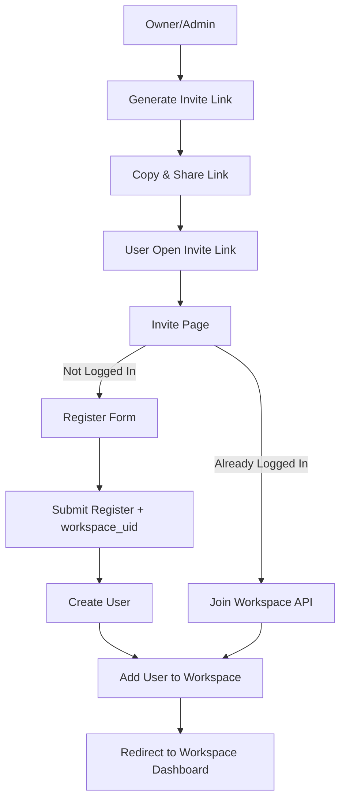

# Team Invite Feature

This document describes the team invite functionality that allows team owners/admins to invite users to join their workspace/team.

## Overview

The invite feature implements a secure, token-based invitation system that supports two main flows:
1. **Existing Users**: Users who are already logged in can accept invites directly
2. **New Users**: Users can register an account while accepting an invite

## Flow Diagram



## API Endpoints

### 1. Create Invite Link

**Endpoint:** `POST /v1/teams/:teamAlias/invite`

**Description:** Generates a unique invite link for a team. Optionally sends an email invitation.

**Authorization:** Required - Team owner/admin only

**Request Body:**
```json
{
  "email": "user@example.com" // Optional
}
```

**Response:**
```json
"https://example.com/invites/abc123def456..."
```

**Notes:**
- If email is provided, an invitation email is sent automatically
- Invite tokens expire after 7 days
- Requires `manage` permission on the team resource

### 2. Get Invite Details

**Endpoint:** `GET /v1/invites/:token`

**Description:** Retrieves invite details without requiring authentication

**Response:**
```json
{
  "team": {
    "id": 1,
    "name": "My Team",
    "alias": "my-team"
  },
  "inviter": {
    "email": "admin@example.com"
  },
  "expiresAt": "2024-01-01T00:00:00.000Z"
}
```

**Error Cases:**
- `404`: Invite token not found
- `400`: Invite token expired
- `400`: Invite token already used

### 3. Accept Invite (Logged-in Users)

**Endpoint:** `POST /v1/invites/:token/accept`

**Description:** Allows logged-in users to accept an invite and join the team

**Authorization:** Required - Must be logged in

**Response:**
```json
{
  "success": true,
  "teamId": 1
}
```

**Notes:**
- Validates that user hasn't reached team join limit based on their plan
- Automatically checks if user is already in the team
- Marks invite as used after successful acceptance

### 4. Register and Accept Invite

**Endpoint:** `POST /v1/invites/:token/register`

**Description:** Allows new users to register and join the team in one step

**Request Body:**
```json
{
  "email": "newuser@example.com",
  "password": "SecurePassword123!"
}
```

**Response:**
```json
{
  "success": true,
  "teamId": 1
}
```

**Notes:**
- Creates a new user account
- Automatically logs in the user
- Adds user to the team
- Marks invite as used

## Database Schema

### team_invites table

```sql
CREATE TABLE "team_invites" (
  "id" SERIAL PRIMARY KEY,
  "token" VARCHAR(255) UNIQUE NOT NULL,
  "teamId" INTEGER NOT NULL,
  "invitedBy" INTEGER NOT NULL,
  "email" VARCHAR(100),
  "expiresAt" TIMESTAMP NOT NULL,
  "usedAt" TIMESTAMP,
  "createdAt" TIMESTAMP DEFAULT NOW(),
  "updatedAt" TIMESTAMP DEFAULT NOW(),
  FOREIGN KEY ("teamId") REFERENCES "teams"("id") ON DELETE CASCADE,
  FOREIGN KEY ("invitedBy") REFERENCES "users"("id") ON DELETE CASCADE
);

CREATE INDEX "IDX_team_invites_token" ON "team_invites" ("token");
CREATE INDEX "IDX_team_invites_teamId" ON "team_invites" ("teamId");
```

## User Plan Limits

The system enforces team join limits based on user plans:

| Plan | Max Teams |
|------|-----------|
| FREE | 5 |
| PREMIUM | 20 |
| UNLIMITED | 100 |

When a user tries to accept an invite:
- System checks current number of teams user is in
- Compares against plan limit
- Throws `USER_REACHES_JOIN_TEAM_LIMIT` error if limit exceeded

## Email Template

The invitation email includes:
- Inviter's email address
- Team name
- Call-to-action button with invite link
- Plain text link as fallback
- Expiration notice (7 days)
- Professional HTML formatting

## Security Considerations

1. **Token Generation**: Uses cryptographically secure random tokens
2. **Expiration**: All invites expire after 7 days
3. **Single Use**: Tokens can only be used once
4. **Permission Check**: Only team owners/admins can create invites
5. **Plan Validation**: Enforces team join limits based on user plan

## Error Codes

| Code | Constant | Description |
|------|----------|-------------|
| 200 | TEAM_NOT_FOUND | Team does not exist |
| 201 | INVITE_TOKEN_NOT_FOUND | Invite token is invalid |
| 202 | INVITE_TOKEN_EXPIRED | Invite token has expired |
| 203 | INVITE_TOKEN_ALREADY_USED | Invite has already been used |
| 204 | INVITE_CREATION_FAILED | Failed to create invite |
| 103 | USER_REACHES_JOIN_TEAM_LIMIT | User has reached team join limit |

## Environment Variables

Configure these in your `.env` file:

```env
# Email Configuration
MAIL_HOST=smtp.gmail.com
MAIL_PORT=587
MAIL_SECURE=false
MAIL_USER=your-email@gmail.com
MAIL_PASSWORD=your-app-password
MAIL_FROM=noreply@example.com

# Frontend URL (for invite links)
FRONTEND_URL=https://example.com
```

## Usage Examples

### Frontend Integration

```typescript
// Generate invite link
const response = await fetch('/v1/teams/my-team/invite', {
  method: 'POST',
  headers: { 'Content-Type': 'application/json' },
  body: JSON.stringify({ email: 'user@example.com' })
});
const inviteLink = await response.json();

// Get invite details
const invite = await fetch(`/v1/invites/${token}`);
const details = await invite.json();

// Accept invite (logged in)
await fetch(`/v1/invites/${token}/accept`, { method: 'POST' });

// Register and accept
await fetch(`/v1/invites/${token}/register`, {
  method: 'POST',
  body: JSON.stringify({
    email: 'newuser@example.com',
    password: 'SecurePass123!'
  })
});
```

## Testing

The feature includes comprehensive unit tests covering:
- ✅ Invite creation with email notification
- ✅ Invite creation without email
- ✅ Token validation (valid, expired, used, not found)
- ✅ Invite usage marking
- ✅ Error handling for all edge cases

Run tests with:
```bash
npm test -- team.service.spec.ts
```
